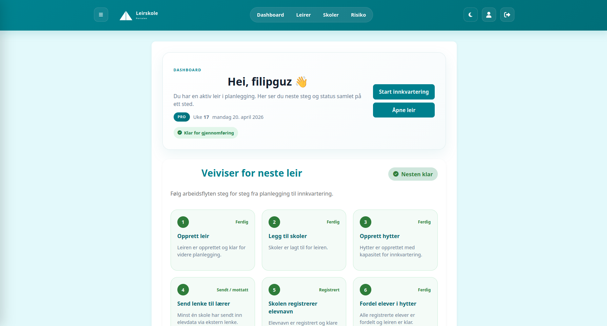
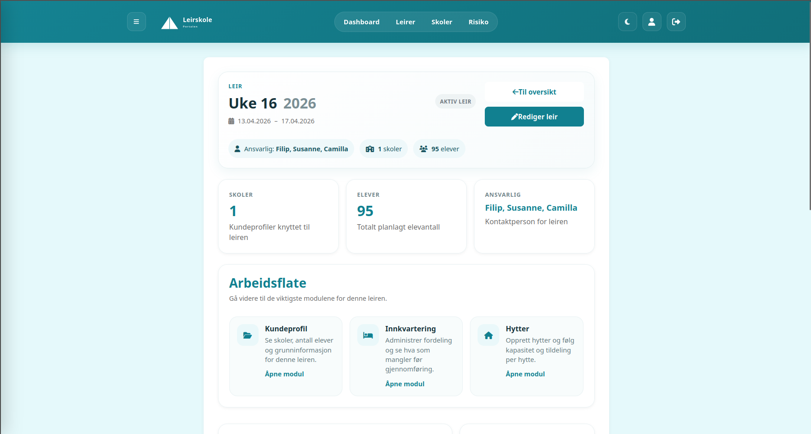
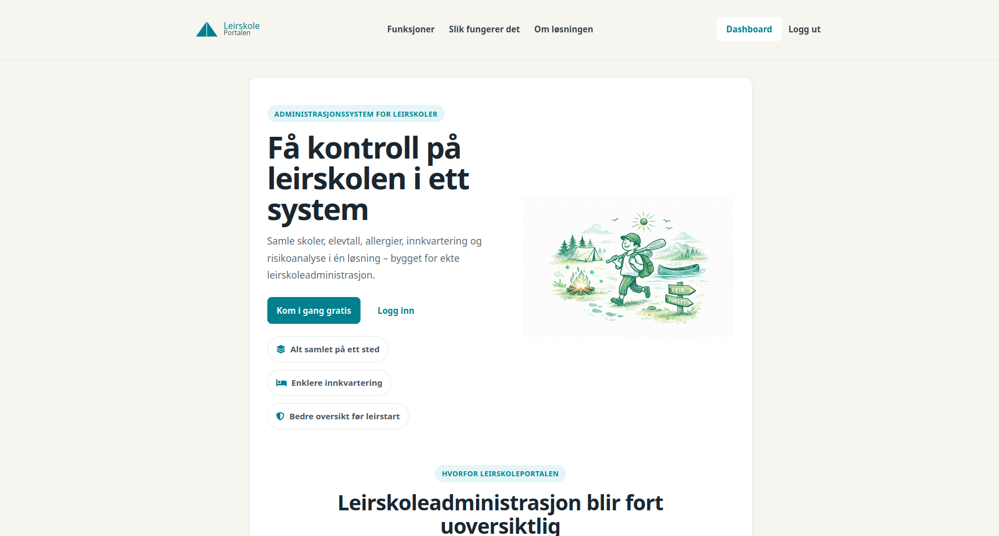

# Leirskoleportalen – SaaS Platform

Leirskoleportalen is a fullstack SaaS application built from scratch to digitalize planning and execution of school camps.

The system replaces manual workflows (Excel and paper) and is designed for real-world use.

---

## 🌐 Live Demo

👉 https://leirskoleportalen.no

---

## 🚀 Features

- Create and manage camps
- Add schools and participants
- Collect student data through external links (no login required)
- Allocate students to cabins
- Risk assessment functionality for planning and documenting activities, improving safety and preparation
- Role-based access control
- Subscription payments (Stripe)

---

## 🧠 Key Concept

One core feature is **token-based external access**:

Teachers receive a unique link that allows them to submit data without logging in.

This simplifies onboarding and improves usability in real-world scenarios.

---

## 🛠 Tech Stack

**Backend**
- Java
- Spring Boot
- Spring Security
- JPA / Hibernate

**Frontend**
- Thymeleaf
- HTML / CSS

**Database**
- PostgreSQL

**Integrations**
- Stripe (subscription payments)

---

## 🧱 Architecture

The application is built using a layered architecture:

- Controller → handles HTTP requests
- Service → contains business logic
- Repository → manages database access
- Model → represents domain data

---

## 🔐 Authentication & Access

- Secure login with Spring Security
- Role-based access control
- Token-based external access for non-authenticated users

---

## 📸 Screenshots

### Dashboard overview

## Camp overview

### Landing page

---

## ⚠️ Note

The full source code is private.

However, I’m happy to walk through the architecture, design decisions and implementation details.

---

## 👤 Author

Filip Gustavsen  
Fullstack Developer (Java / Spring Boot)
